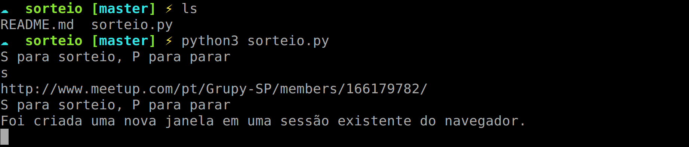

#Script para sorteio de brindes nos encontros do GruPy-SP

Para rodar o script é necessário que utilize a versão 3 do Python e que insira a lista dos presentes no encontro através da plataforma do Meetup.

O que é isso? É de comer?

É um script feito em python (versão 3) pelo [Mário Guedes](http://www.meetup.com/Grupy-SP/members/150470042/) para realização de sorteio de brindes.

Isso foi feito para facilitar a vida dos organizadores que realizam eventos através da plataforma Meetup.

Quando você exporta o arquivo .xls ou .csv do Meetup para criar a lista de presença, em uma das colunas há o perfil de cada participante do Meetup. Apenas pegando aquela coluna e inserindo no código, basta rodar o script e o navegador padrão da sua máquina irá abrir uma janela com o sorteado(a).

Se o Python 3 estiver como versão padrão do seu sistema:
`python sorteio.py`

Se caso no seu sistema tiver a versão 2 como padrão mas tem também a versão 3:
`python3 sorteio.py`

Para encerrar o script, basta apertar CTRL + C e rodar novamente.

Caso haja dúvidas, entre em contato em [eric8197@gmail.com](mailto:eric8197@gmail.com)

